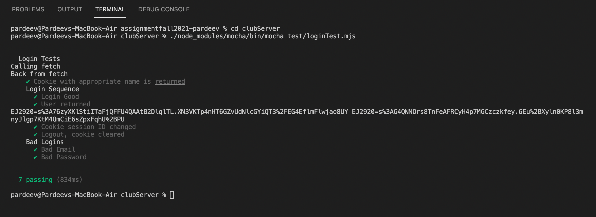
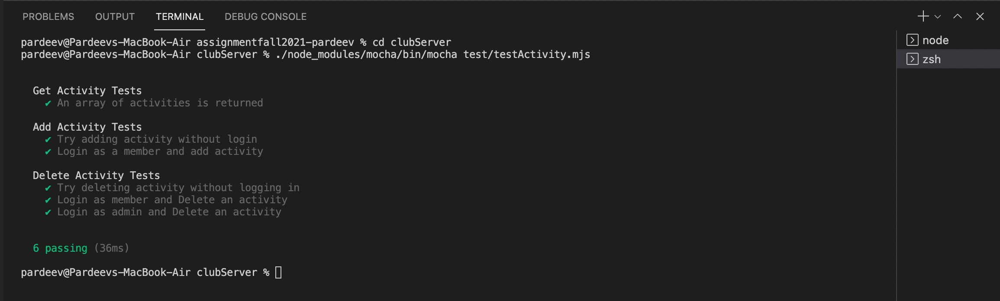
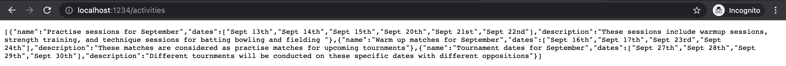
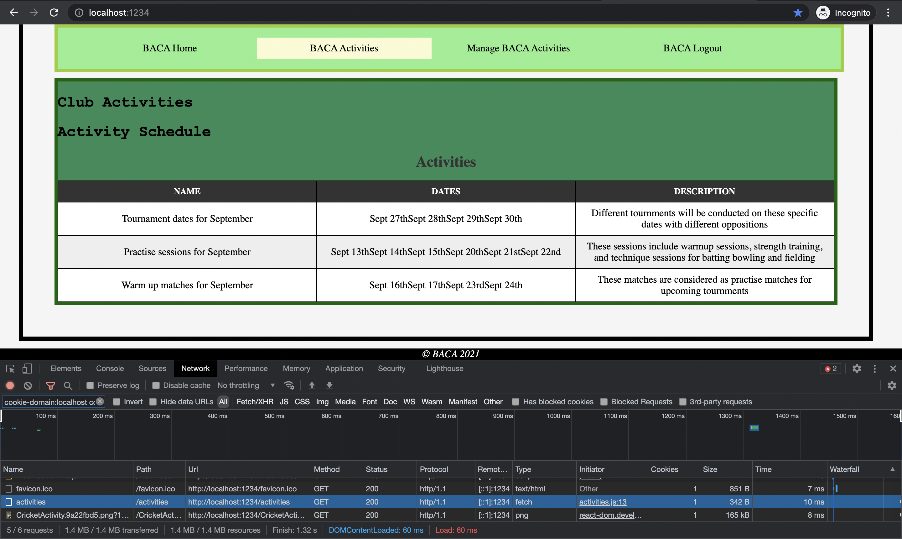

# Homework #12 Solution 

**Student Name**:  Pardeev Reddy Maramreddy

**NetID**: ej2920

## Question 1 - Members and Activities DataBases

### (a) Create Initial Activity and Members Databases

`initDataBases.mjs`

```jsx
import { readFile } from "fs/promises";
import DataStore from "nedb-promises";

const activitiesDB = DataStore.create("./activitiesDB");
const membersDB = DataStore.create("./membersDB");

const activities = JSON.parse(
    await readFile(new URL("./eventData.json", import.meta.url))
);

const members = JSON.parse(
    await readFile(new URL("./clubUsers3Hash.json", import.meta.url))
);

async function cleanAndInsert() {
    let numRemoved1 = await activitiesDB.remove({}, { multi: true });
    console.log("clearing database 1, removed " + numRemoved1);

    let numRemoved2 = await membersDB.remove({}, { multi: true });
    console.log("clearing database 2, removed " + numRemoved2);

    let activitiesDocs = activitiesDB.insert(activities);
    console.log("Added " + activitiesDocs.length + " activities");

    let membersDocs = membersDB.insert(members);
    console.log("Added " + membersDocs.length + " members");
}

cleanAndInsert();
```
### (b) Integrate Member Database Into Server
`clubMembers.mjs`
```jsx
let db = new DataStore({ filename: "./membersDB", autoload: true });

app.get('/members', checkAdminMiddleware, function (req, res) {
    db.find({}).then(function (members) {
        res.json(members);
      });
});
```
`clubServer.mjs`
```jsx
let db = new DataStore({ filename: "./membersDB", autoload: true });

app.post('/login', express.json(), function (req, res) {
    let password = req.body.password;
    let auser = db.findOne({ email: req.body.email }); 
    if (!auser) {
        res.status(401).json({ error: true, message: 'User/Password error' });
        return;
    }
    let verified = bcrypt.compareSync(password, auser.password);
    if (verified) {
        req.session.regenerate(function (err) {
            if (err) {
                console.log(err);
            }
            let newUserInfo = Object.assign(auser);
            delete newUserInfo.password;
            req.session.user = newUserInfo;
            res.json(newUserInfo);
        });
    } else {
        res.status(401).json({ error: true, message: "User/Password error" });
    }
});
```
### (c) Integrate Activity Database into server
`clubActivities.mjs`
```jsx
let db = new DataStore({ filename: "./activitiesDB", autoload: true });

app.get('/activities', checkCustomerMiddleware, async function (req, res) {
    res.json(await db.find({}));
});

app.post('/addActivity', express.json({ limit: 5000 }), checkCustomerMiddleware, jsonErrors, function (req, res) {
    console.log(`path /addActivity received: ${JSON.stringify(req.body)}`);
    var data = [];
    data.push(req.body);
    db.insert(data, function (err, newDoc) { });
    res.send(await db.find({}));
});

app.delete("/delete/:id", checkAdminMiddleware, async function (req, res) {
    var index = req.params.index;
    db.remove(
      { _id: id },
      { multi: false },
      function (err, numRemoved) {
        db.loadDatabase(function (err) {});
      }
    );
    res.send(await db.find({}));
  }
);
```

## Question 2 - Testing Server with DataBases

### (a) Login Tests

* We need not modify any of our Mocha based login tests from homework #11.


### (b) Activity Tests

* We need not modify any of our Mocha based Activity tests from homework #11.


## Question 3 - Question 3. (10 pts) 

### (a) GUI and Server development

1. clubReact development Parcel bundler is running on `http://localhost:1234` with host - `localhost` and TCP port - `1234`

2. clubServer development Parcel bundler is running on `http://localhost:8886` with host - `localhost` and TCP port - `8886` (This is explicitely specified).

### (b) Proxy Configuration

`.proxyrc.json`

```json
{
    "/members": {
        "target": "http://localhost:9996"
    },
    "/activities": {
        "target": "http://localhost:8886"
    }
}
```


## Question 4 - Fetch for Activities

### (a) Members Activities Component

### (b) Fetch Activities in the Component
`activities.js`
```jsx
import React from "react";
import cricket from "../clubProject/images/CricketActivity.png";

class Activities extends React.Component {
    constructor(props) {
        super(props);
        this.state = {
            events: []
        };
    }

    componentDidMount() {
        fetch('/activities').then(response => response.json()).then((activities) => {
            this.setState({
                events: activities
            });
        })
    }

    render() {
        return (
            <>
                <header>
                    <h1>Activities Page</h1>
                </header>
                <figure>
                    
                    <figcaption>Fig.2 - Image depicting Cricket Trophy</figcaption>
                </figure>
                <main>
                    <h2>Club Activities</h2>
                    <h2>Activity Schedule</h2>
                    <table id="table_id">
                        <caption>Activities</caption>
                        <thead>
                            <th>Name</th>
                            <th>Dates</th>
                            <th>Description</th>
                        </thead>
                        <tbody>
                            {this.state.events.map(
                                (event) => {
                                    return (
                                        <tr>
                                            <td>{event.name}</td>
                                            <td>{event.dates}</td>
                                            <td>{event.description}</td>
                                        </tr>
                                    );
                                }
                            )}
                        </tbody>
                    </table>
                </main>
                <footer>
                    &copy; BACA 2021
                </footer>
            </>
        );
    }

}

export default Activities;
```

